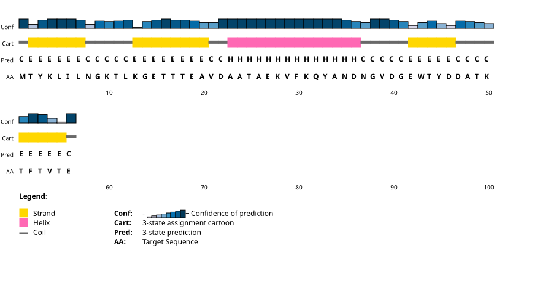

# MODELING EMPLOYING LIMITED DATA (MELD) in AMBER

## Leraning Outcomes
* Be able to setup and run replica exchange MELD simulation in parallel on GPUs.

## Introduction

Predicting how a protein folds into its native structure from sequence alone is a long-standing problem in computational biology. In theory, molecular dynamics should be able to do so, since the force field establishes an energy landscape with the native state as its global minimum, and molecular dynamics provides not just a single predicted structure but also the populations and mechanisms involved. In reality, however, the bottleneck lies in sampling: the conformational space of even a small polypeptide is prohibitively large, and proteins fold on microsecond-to-millisecond timescales that brute-force atomistic MD cannot reach without specialized hardware.

MELD (Modeling Employing Limited Data) tackles this by combining physics with external information in a Bayesian framework: the force field acts as the prior, the external data provides the likelihood, and MELD then samples the resulting posterior. Unlike conventional restrained molecular dynamics, MELD is designed to make use of information that is vague, sparse, or only partly correct. Restraints are organized into groups and collections, and at any given time, only a certain fraction of them needs to be fulfilled. During the simulation, the best-satisfied subset of restraints is activated on the fly, so it works out which restraints are correct as the protein folds, rather than being forced to obey all the restraints. When folding is carried out on the basis of the amino acid sequence, the restraints are derived from the Coarse Physical Insights (CPI): general truths about globular proteins — namely, that they have hydrophobic cores, that they form secondary structure, and that their β-strands pair. The sampling is carried out using Hamiltonian and temperature replica exchange (H,T-REMD), with the hot replicas, which have weak restraints, exploring a wide range of conformations and the cool replicas, which have fully-scaled restraints, adopting structures that are similar to the native ones.<sup>[[1](https://www.pnas.org/doi/10.1073/pnas.1506788112),[2](https://www.pnas.org/doi/10.1073/pnas.1515561112)]</sup>


In this tutorial you will fold the B1 domain of protein G (PDB: 3GB1) starting from its sequence. You will build the system with `tleap` (ff19SB, implicit solvent) and minimize it, generate CPI restraints, run an H,T-REMD MELD simulation in parallel across GPUs, and analyze the resulting trajectories to identify the folded state as a dominant, low-energy population.

**Assumptions**: This tutorial assumes that you have experience building systems using ```tleap```, running MD simulations in parallel with ```pmemd.cuda.MPI```, knowledge on terminology and typical variables used for standard MD simulations in ```AMBER```, and ```MELD```. <br>If you are not familiar with setting up a system, running MD simulations please refer to the more basic tutorials before attempting to run ```Replica Exchange MELD``` simulations.

## Method

### 1. System setup

This is the earliest stage where we create the topology and the initial coordinate file for the intended system 3GB1. Because MELD begins from an extended chain and lets the restraints and the force field guide the fold, the starting geometry carries no structural information.

For this tutorial we will generate initial peptide chain using the sequence  alone. Use following command to download the FASTA entry for 3GB1 from the PDB.
```
curl -o 3gb1.fasta https://www.rcsb.org/fasta/entry/3GB1
```
<i>Note that we take only the sequence from this entry. The deposited coordinates are never read; they are reserved for the final validation step, where the folded ensemble is compared against the experimental structure.</i>

The chain is then built with `tleap`. We use the `ff19SB` force field with `mbondi2` radii, which are the radii appropriate for the `igb=5` generalized Born model. Rather than writing the `tleap` input by hand, the helper script [makeLeap.x](1_system_setup/makeLeap.x) translates the one-letter FASTA sequence into the three-letter residue names that `tleap` expects.

Run [makeLeap.x](1_system_setup/makeLeap.x)  with the following commands for 3GB1:
```
chmod +x makeLeap.x
./makeLeap.x -s 3gb1.fasta -o 3gb1 
```
This writes [leap.in](1_system_setup/leap.in). Execute it, capturing the output so that nothing is missed:
 ```
 tleap -f leap.in 2> leap.log
 ``` 
 Read leap.log before continuing. Warnings about unperturbed charge for the built chain are ignored since implicit solvent simulation. However, any errors about unrecognized residues or missing parameters must be resolved at this stage because they will cause the system to be unrunnable later. A successful run produces [3gb1.prmtop](1_system_setup/3gb1.prmtop) and [3gb1.inpcrd](1_system_setup/3gb1.inpcrd).
 
Next we apply Hydrogen Mass Repartitioning (HMR)<sup>[[3](https://doi.org/10.1021/ct5010406)]</sup>. HMR shifts mass from heavy atoms to the hydrogens bonded to them, slowing the fastest bond vibrations without changing the total mass or thermodynamics of the system. This allows a longer timestep of about 4 fs instead of the usual 2 fs. The repartitioning is handled by `ParmED`, which ships with AMBER, using the input file [HMR.in](1_system_setup/HMR.in):
```
parm 3gb1.prmtop
hmassrepartition
outparm 3gb1_HMR.prmtop
quit
```
To execute simply use command:
```
parmed -i HMR.in
```
This creates [3gb1_HMR.prmtop](1_system_setup/3gb1_HMR.prmtop), which is used for the remainder of the tutorial. Note that the coordinate file has not changed: only the masses have been redistributed.

Lastly, we carry out a minimization. Since MELD is in charge of guiding the chain to its native fold, we are not attempting to pre-organise the structure in any way; our only requirement is to eliminate the steric clashes and strained geometries that tleap leaves behind when it assembles the chain from scratch, so that the initial steps of the dynamics do not fail. A brief minimisation in implicit solvent is enough.

```
energy minimization
 &cntrl
  imin=1, maxcyc=2000, ncyc=500,
  ntwr = 1000, ntpr = 100,
  cut = 999.0, rgbmax = 999.0,
  ntb = 0, igb = 5, saltcon = 0.0,
 /
 ```
The above settings follow from implicit-solvent treatment. The flag `ntb = 0` removes periodic boundaries while `igb = 5` selects the generalized Born model, so there is no solvent box and no cutoff is needed (`cut = 999.0`, `rgbmax = 999.0`).

Run the minimization using [min.in](1_system_setup/min.in):
```
srun $AMBERHOME/bin/pmemd -O -i min.in -p 3gb1_HMR.prmtop -c 3gb1.inpcrd -o min.out -r min.rst -inf min.info
```
Check min.out and confirm that the energy has decreased smoothly and converged, with no `NaN` values. The resulting [min.rst](1_system_setup/min.rst) is the coordinate file from which every replica of the MELD simulation will be launched, so it is worth inspecting visually before committing to the far more expensive stages ahead. What you should see is an extended, unfolded chain with clean bond geometry and no overlapping atoms.


### 2. MELD Replica Exchange MD
With a topology and a relaxed starting structure in hand, we now proceed with constructing the information that will direct the folding. For this purpose two programs are used: [gen_restraints.py](2_meld_remd/gen_restraints.py) converts a secondary structure string into the restraint files which tell MELD what it knows about the protein, and [gen_md_inputs.py](2_meld_remd/gen_md_inputs.py) takes a single Amber input file and expands it out into the series of replicas that shows how this knowledge is applied throughout the ensemble.

#### 2.1. CPI restraint generation:
The Coarse Physical Insights introduced above are, in practice, primarily 3 collections of distance and torsion restraints. None of them requires knowledge of the native structure; all that is needed is the sequence and a prediction of the secondary structure.

The secondary structure prediction is obtained from the sequence alone, using the [PSIPRED](https://bioinf.cs.ucl.ac.uk/psipred/) server at UCL. Provided the sequence, the server returns per-residue assignment of helix, strand or coil `(H/E/.)` together with a confidence score for each. Reference file [ss.dat](2_meld_remd/ss.dat) contains this structural information for 3GB1.



#### 2.2. generate replica input files


## References
1. MacCallum, J. L.; Perez, A.; Dill, K. A. Determining Protein Structures by Combining Semireliable Data with Atomistic Physical Models by Bayesian Inference. *Proc. Natl. Acad. Sci.* **2015**, 112 (22), 6985–6990. https://doi.org/10.1073/pnas.1506788112.
2. Perez, A.; MacCallum, J. L.; Dill, K. A. Accelerating Molecular Simulations of Proteins Using Bayesian Inference on Weak Information. *Proc. Natl. Acad. Sci.* **2015**, 112 (38), 11846–11851. https://doi.org/10.1073/pnas.1515561112.
3. Hopkins, C. W.; Le Grand, S.; Walker, R. C.; Roitberg, A. E. Long-Time-Step Molecular Dynamics through Hydrogen Mass Repartitioning. *J. Chem. Theory Comput.* **2015**, 11 (4), 1864–1874. https://doi.org/10.1021/ct5010406.